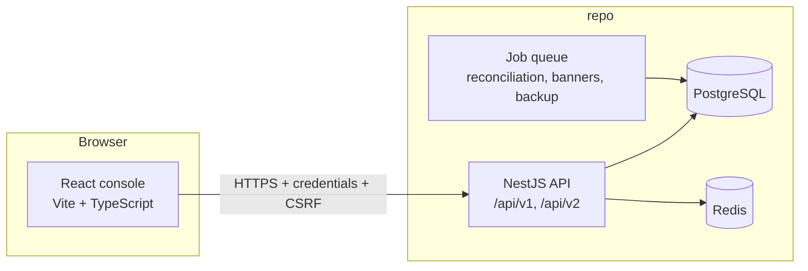

# SentinelDesk — Design Document

## 1. Purpose

This document describes **SentinelDesk** as implemented in this repository: an **on-prem, offline-capable newsroom platform** for multi-source feed ingestion, editorial review, deduplication and merge workflows, **internal licensing settlement** (charges, refunds, freezes), and **immutable auditing**. The stack is a **TypeScript fullstack monorepo** under `repo/` (`frontend/` React + Vite, `backend/` NestJS), with PostgreSQL as the system of record and Redis for hot reads and rate limiting.

Primary personas: **Editors** (ingestion, queue, story review), **Finance Reviewers** (transactions, charges, refunds), **Auditors** (audit reports, CSV export, freeze release), and **Administrators** (roles, permissions, per-user rate limits, system thresholds). The server enforces permissions and **role-based redaction**; the UI mirrors permissions but does not replace backend checks.

---

## 2. System Goals

- Operate **without reliance on the public internet** for core workflows (local auth, local OpenAPI, on-host jobs).
- Expose **versioned REST APIs** (`/api/v1`, `/api/v2`) with **Swagger/OpenAPI** for offline QA and integration.
- Enforce **security** on the backend: session cookies, **CSRF** on authenticated writes, Helmet, validation pipes, centralized **redaction** interceptors, parameterized DB access (Prisma), optional **TOTP MFA**.
- Model **finance controls**: internal **payment channels** (prepaid balance, invoice credit, purchase-order settlement) with **signed payloads**, timestamp/nonce replay windows, and **idempotency**.
- Support **editorial traceability**: merges and repairs require notes; dedup uses URL normalization and content fingerprints; audit logs are queryable and exportable.

---

## 3. High-Level Architecture

### Runtime services (typical `repo/docker-compose.yml`)

| Service | Role | Default port (`repo/README.md`) |
| :--- | :--- | :--- |
| **Frontend** | React SPA dev server or static build | `5173` |
| **Backend API** | NestJS, Prisma migrations on startup | `3000` |
| **PostgreSQL** | Stories, versions, ledger, audit, users, jobs | `5432` |
| **Redis** | Hot read TTL cache, rate-limit helpers | `6379` |

**Startup:** from `repo/`, `docker compose up --build` (migrations run in the backend container on boot).

---

## 4. Backend Design

### 4.1 Layout

- **Bootstrap:** `repo/backend/src/main.ts` — global prefix `api`, URI versioning `v1`/`v2`, CORS for the Vite origin, Helmet, cookie parser, validation pipe, JSON exception filter, global **redaction** interceptor, Swagger at `/openapi/v1` and `/openapi/v2`.
- **Composition root:** `repo/backend/src/app.module.ts` — wires domain modules and `ApiV1Module` / `ApiV2Module`.
- **Domain modules (illustrative):** `repo/backend/src/modules/` — `ingestion`, `stories`, `story-versions`, `cleansing`, `dedup`, `merge`, `transactions`, `refunds`, `freezes`, `ledger`, `payment-channels`, `audit-logs`, `reports`, `admin`, `jobs`, `observability`, `health`, plus `prisma`, `cache` (Redis), `rate-limit`, `roles-permissions`, `users`.
- **Security:** `repo/backend/src/security/` — local auth, session, MFA, guards used by versioned API modules.

### 4.2 API versioning

- Both **v1** and **v2** expose the same resource areas; **v2** adds response metadata where documented (e.g. policy blocks on login, dedup thresholds, merge strategies, pricing hints, audit date-format hints, payment-channel verification metadata). The React client defaults to **v1** and can target **v2** via `VITE_API_VERSION`.

### 4.3 Security model

- **Authentication:** local username/password; minimum password length **12**; **lockout** after **5** failed attempts for **15 minutes**; **idle** session timeout **30 minutes**; **absolute** timeout **12 hours**; optional **TOTP MFA**.
- **Session:** HTTP-only cookie `sid`; `GET /auth/me` and CSRF rotation via `GET /auth/csrf`.
- **CSRF:** `x-csrf-token` on authenticated **POST/PUT/PATCH/DELETE** (payment channel callbacks are signature-based and exempt from the session CSRF flow).
- **Payment channels:** `POST /payment-channels/:channel/charge` requires channel-specific secrets at startup, headers (`x-system-id`, `x-signature`, `x-timestamp`, `x-nonce`, `x-idempotency-key`), signature verification, **replay rejection** beyond a short window (e.g. five minutes), and **idempotency** so duplicate or tampered posts cannot apply twice.
- **Defense in depth:** rate limiting (default **60 requests per minute per user**, overridable by admin), role-based field **masking/redaction** on responses, sensitive profile paths gated by permissions.

### 4.4 Domain areas (API surface, summary)

- **Health:** `GET /v1|v2/health`, `.../health/summary` — DB/Redis readiness and operational summary.
- **Auth:** login, logout, me, CSRF, MFA enroll/verify.
- **Ingestion:** multipart upload (XML/JSON/CSV), URL batches; parsing and persistence into the story pipeline.
- **Stories / editor queue:** list and review; diffs between versions; **merge** (strategies such as replace/append/keep both) with **mandatory notes**; **repair** with audit trail.
- **Dedup / cleansing:** URL normalization, SimHash/MinHash-style fingerprints, configurable thresholds (admin); cleansing events logged for traceability.
- **Transactions / ledger / refunds / freezes:** internal charges (e.g. licensed story bundles), approval, refunds tied to story versions, **freeze** for disputes, **release** by auditor role; ledger immutability patterns as implemented in services.
- **Reports / audit:** searchable audit log; **CSV export** with filters (date range **MM/DD/YYYY**, user, action type).
- **Admin:** roles, user-role assignment, per-user rate limits, system thresholds (e.g. dedup sensitivity), permission-sensitive operation introspection.
- **Alerts / observability:** in-app alerts dashboard; local metrics/logs/traces retention policy per README (**14 days**); jobs for reconciliation, banners, **nightly backup** (**2:00 AM**, **30-day** retention, restore verification script).

---

## 5. Frontend Design

### 5.1 Stack

- **Build:** Vite, React, TypeScript.
- **Routing:** `react-router-dom`; protected shell remounts on user/role switch to avoid stale permission state (see `repo/frontend/README.md`).

### 5.2 Routes (SPA paths)

| Path | Permission (typical) | Notes |
| :--- | :--- | :--- |
| `/login` | — | Local login; unauthenticated entry |
| `/ingestion` | `stories.review` | Feed upload and URL batches |
| `/editor-queue` | `stories.review` | Queue, diffs, merge/repair |
| `/stories` | `stories.review` | Story listing/search |
| `/transactions` | `transactions.read` | Charges, approvals, refunds, freezes (finer actions gated server-side) |
| `/admin` | `admin.manage` | Roles, rate limits, thresholds |
| `/audit-reports` | `audit.read` | Search + CSV export |
| `/alerts` | `alerts.read` | Operational alerts and job-related UI |
| `/security` | (available to authenticated users) | Security-oriented session/MFA UX |

`admin.manage` acts as an **override** for route access where implemented. Deep-links without permission redirect to the **nearest allowed** route.

### 5.3 API client behavior

- Base URL from `VITE_API_BASE_URL` (default local backend `http://localhost:3000/api`).
- Requests use **credentials**; **CSRF** token is held **in memory** only, refreshed after session restore via `/auth/csrf`.
- Write methods attach `x-csrf-token` per backend expectations.

---

## 6. Core Workflows (summary)

### 6.1 Ingestion and editorial

1. Editors upload feeds or submit URL batches; backend parses and normalizes content.
2. **Dedup** highlights near-duplicates; **cleansing** events are recorded.
3. **Editor queue** surfaces items needing review; **diff** compares versions; **merge** requires strategy + **mandatory change note**; **repair** maintains auditability.

### 6.2 Finance and settlement

1. Finance reviewers create and approve **charges** against story versions (bundle pricing configurable server-side).
2. **Refunds** (including partial) tie to specific story versions where applicable.
3. **Freezes** hold disputed flows until an **auditor** releases them.
4. Internal **payment channels** accept only **signed**, fresh, **idempotent** callbacks.

### 6.3 Compliance and operations

1. **Audit reports** filter immutable logs; CSV export for traceability (merges, approvals, refunds, etc.).
2. **Administrators** configure roles, per-user rate limits, and dedup-related thresholds.
3. **Jobs** run reconciliation, notification banners, and scheduled backups; **restore_verify** script validates backup integrity (target **≤ 2 hour** recovery check per README).

---

## 7. Data and Persistence

**PostgreSQL** (Prisma schema and migrations under `repo/backend/prisma/`) holds users, roles, permissions, stories and versions, dedup clusters, ingestion/cleansing/merge audit data, transactions, ledger entries, refunds, freezes, audit log rows, job/alert-related state, and encrypted sensitive columns where implemented.

---

## 8. Observability and Reliability

- **Health:** `GET /api/v1/health` and `/api/v1/health/summary` (and v2 equivalents).
- **OpenAPI:** `/openapi/v1`, `/openapi/v2` (JSON under `openapi/v1.json`, `openapi/v2.json`).
- **Testing layout:** `repo/backend/unit_tests/` (business logic), `repo/backend/API_tests/` (HTTP/e2e-style); frontend Vitest + Playwright; aggregate `repo/run_tests.sh` / `npm run test:all` from monorepo root.

---

## 9. Assumptions and Constraints

- **Single-tenant / on-prem** deployment; primary threat model is insider misuse, session hijack, and tampered internal callbacks—not multi-tenant SaaS isolation.
- **CORS** allows configured browser origins (default Vite localhost) with credentials.
- External identity providers and public-cloud-only operation are **out of scope** for this design doc.

---

## 10. Non-Goals (current scope)

- Public multi-tenant SaaS, per-tenant billing, and internet-hosted IdPs.
- Native mobile apps (web console only).
- The **Meridian Operations Hub** stack (Go Gin + Templ BFF, hiring/support/inventory/compliance modules under a different layout) — that document described a different codebase and is **not** this project.

---

## 11. References

- Monorepo overview and ports: `repo/README.md`
- Backend runbook: `repo/backend/README.md`
- Frontend routes and CSRF behavior: `repo/frontend/README.md`
- Endpoint tables and conventions: `docs/api-spec.md`
- Product intent (ingestion, finance, security narrative): `metadata.json` at repository root
